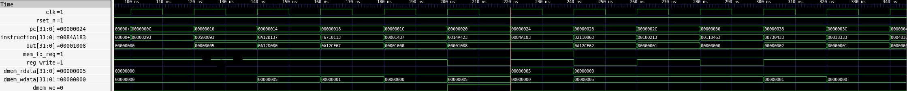

# Risc V CPU 

This project has the objective of creating a single cycle CPU using riscV-RV321 architecture.

The standard has the sequent rules (taken form the risk V green card)

1) Operation assumes unsigned integers (instead of 2's complement)
2) The least significant bit of the branch address in jalr is set to 0
3) (signed) Load instructions extend the sign bit of data to fill the 32-bit register
4) Kepпa Replicates the sign bit to fillI ini the th leftmost lefimost bits of the result during right shift
5) Multiply with one operand signed and one unsigned CORE INSTRUCTION FORMATS
6) The Single version does a single-precision operation using the rightmost 32 bits of a 64- 27 26 25 24 19 15 14 11 bit F register
7) Classify writes a 10-bit mask to show which properties are true (e.g.,-inf, -0,+0, +inf.lenorm. denorm, ...)
8) Atomic memory operation; nothing else can interpose itselfbetween the read and the
write of the memory location
The immediate field is sign-extended in RISC-V


# Microarchitecture
The next image shows the complete datapath of the single cycle cpu. the CPU uses a Harvard architecture (instead of a Von Neumann one). The choice is necessary for a single cycle implementation, since it is imperative to execute an instruction with the data in a single clok cycle (not possible if the data and instruction memory arent separate).

The Hardware Descripting Langage Used is SystemVerilog. 


<p align="center">
  
</p>

# Inplemented Instruction
# File tree
the files of the repository are mainly divided in:
  - RTL
  - testbench (tb)
## RTL
## Testbench
the cpu test is executed using cocotb (python) to verify the results obtained 
The file contained in the tesbench are 


# Simulation
## Simulation Program 

## Simulation results
### Baseline Single-Cycle Execution Trace

Simulation waveform generated via Verilator and Cocotb, demonstrating verified execution of the RV32I instruction set:



* **Clock Frequency:** 50 MHz (20 ns cycle time).
* **Memory Transactions Highlighted:**
  * **200 ns – 220 ns (SW):** Data memory write assertion (`dmem_we = 1`) targeting address `0x00001008` with payload `0x00000005`.
  * **220 ns – 240 ns (LW):** Single-cycle memory load (`mem_to_reg = 1`) retrieving `0x00000005` onto `dmem_rdata` with register write-back assertion (`reg_write = 1`).
* **Datapath Latency:** Zero-wait-state memory access completing in a single clock cycle.


# Advanced Applicarions
For an extended version exploring emerging memory technologies (STT-MRAM) and 7nm synthesis (DTCO/STCO), see the companion repository: rv32i-stco-framework.


# License and Copyright
This project is licensed under the **Apache License 2.0** - see the [LICENSE](License) file for details.

```text
Copyright (c) 2026 Oleg Petryshyn
All rights reserved.
